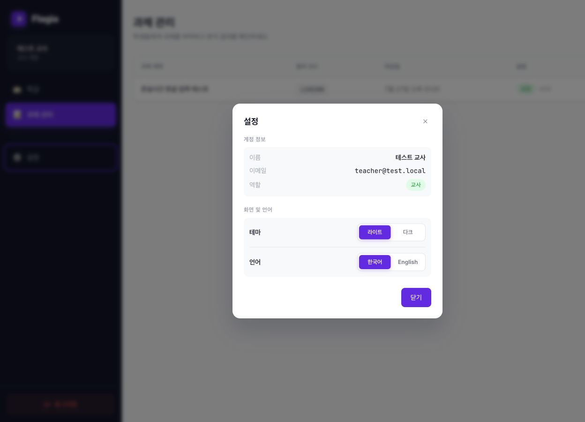
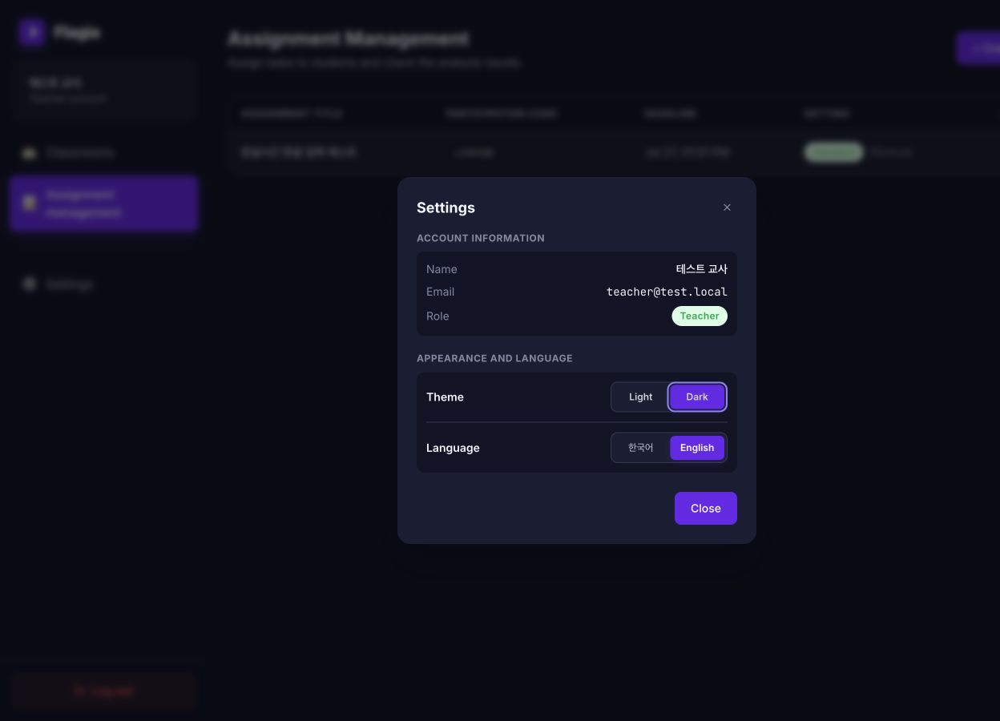
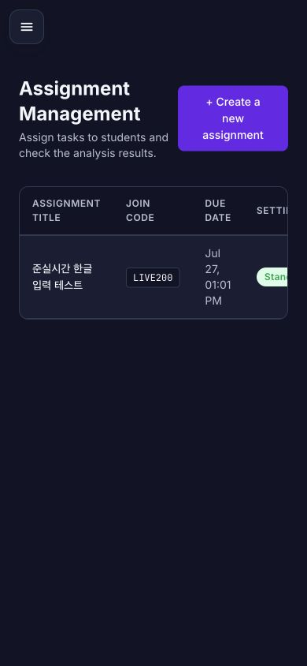
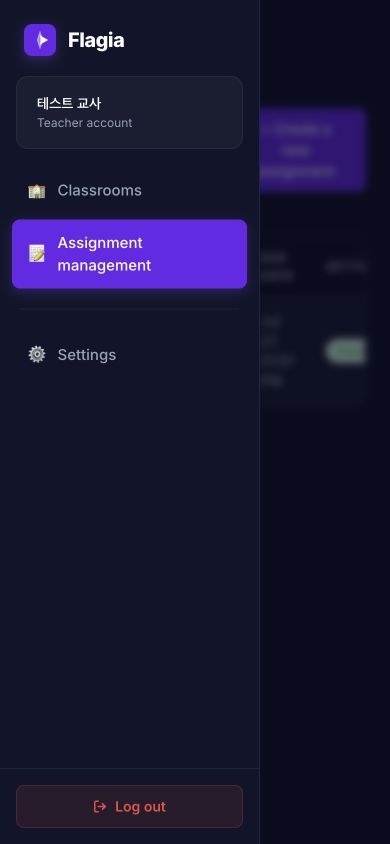
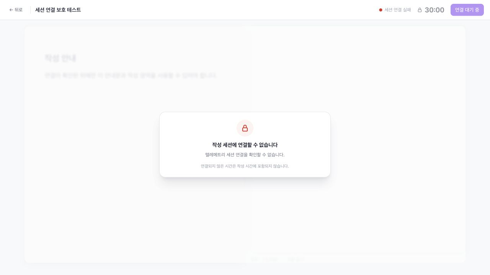
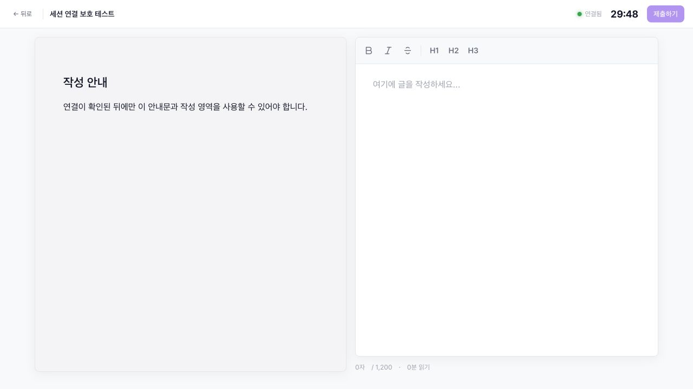

# Theme, language, and app-shell walkthrough

## Settings — Korean light theme

- The former Security section is removed.
- Settings now contains account information, Light/Dark theme controls, and Korean/English language controls.
- Theme and language changes apply immediately and persist after reload.

## Settings — English dark theme

- Neutral surfaces, borders, shadows, and text use the complete dark palette.
- Flagia purple and green integrity/status semantics remain unchanged.
- The document reports `data-theme="dark"` and `lang="en"` after selection and after reload.

## Mobile shell without the white logo bar

- The duplicate white logo bar is gone.
- A compact floating menu control preserves access to navigation without consuming a full header row.

- The sidebar retains the single Flagia brand treatment.
- Usage guide is absent.
- Settings remains available and the page is dimmed behind the drawer.

## Localization and theme checks

- Vue I18n Korean and English catalogs cover all developer-owned frontend text.
- An English-mode DOM audit found Korean only in mock user-authored data: the teacher name and assignment title.
- Date output switches between `ko-KR` and `en-US`.
- REST and realtime errors expose stable codes so clients localize failures without relying on Korean prose.
- Frontend and backend production builds pass.
- No browser warnings or errors were produced in the verified flows.

---

# WebSocket session lock walkthrough

## Disconnected or rejected session

- The status remains red and reports the session failure instead of treating `auth_ok` as a complete connection.
- The timer displays a lock and remained at `30:00` throughout a 2.2-second observation.
- The template and writing pane are covered by a blocking overlay.
- The editor rendered with `contenteditable="false"`.
- The submit action remained disabled and displayed `연결 대기 중`.

## Confirmed session

- The status turns green only after the server sends `session_ready`.
- The timer advanced from `29:54` to `29:52` during a 2.2-second observation.
- The template is readable and the blocking overlay is removed.
- The editor rendered with `contenteditable="true"`.

## Verification environment

The states above were exercised against a local WebSocket/API mock using an Admin identity. The disconnected case returned a session error after successful socket authentication; the connected case returned `session_ready`.

The active connection was also interrupted and restored:

- On disconnect, the overlay returned and the timer remained at `29:04` for a 2.2-second observation.
- After automatic reconnect and a new `session_ready`, the overlay cleared and the timer advanced from `28:57` to `28:55`.
- No browser console warnings or errors were produced during the tested states.
