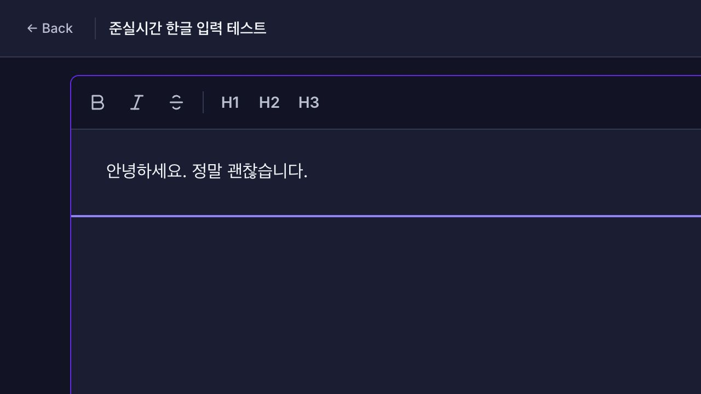
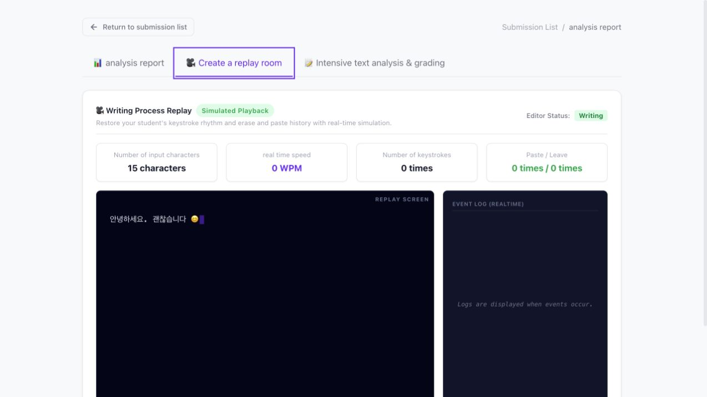
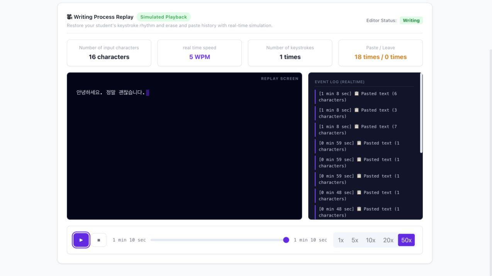

# Exact Korean/IME replay walkthrough

## Student source document

- The connected student editor finished with `안녕하세요. 정말 괜찮습니다.`.
- The browser flow exercised Korean insertion, deletion, full-range selection,
  replacement, and final submission.
- The mock protocol captured 21 authoritative v3 document frames. Every frame
  included a compact text patch plus its post-transaction cursor and selection.
- Two frames recorded full-document selections (`selectionLength` 15 and 14),
  proving that selection-only transactions are preserved instead of forcing the
  replay cursor to the document end.
- The final periodic snapshot, live teacher relay, and submitted source all
  matched the same Korean text.

## Replay start

- At timeline start, replay renders the first stored editor state immediately.
- The caret comes from the recorded frame rather than the legacy Hangul
  automaton or a 2-second snapshot approximation.

## Replay completion

- Playback at 50× traversed the complete recorded timeline and ended at
  `안녕하세요. 정말 괜찮습니다.`.
- The final replay frame exactly matched the submitted document.
- The browser controller injects text through paste-like browser input, so the
  paste counter in these visual fixtures is not representative of a physical
  keyboard. Deterministic replay tests separately cover intermediate Hangul
  composition states, compound vowels/final consonants, Backspace, mid-document
  replacement, mixed Korean/English/emoji, snapshot recovery, and legacy
  fallback detection.

## Verification

- Frontend `test:replay` passed.
- Frontend production type-check and build passed.
- Backend document-frame validation test and production build passed.
- `git diff --check` passed.

---

# Theme, language, and app-shell walkthrough

## Settings — Korean light theme

- The former Security section is removed.
- Settings now contains account information, Light/Dark theme controls, and Korean/English language controls.
- Theme and language changes apply immediately and persist after reload.

## Settings — English dark theme

- Neutral surfaces, borders, shadows, and text use the complete dark palette.
- Flagia purple and green integrity/status semantics remain unchanged.
- The document reports `data-theme="dark"` and `lang="en"` after selection and after reload.

## Mobile shell without the white logo bar

- The duplicate white logo bar is gone.
- A compact floating menu control preserves access to navigation without consuming a full header row.

- The sidebar retains the single Flagia brand treatment.
- Usage guide is absent.
- Settings remains available and the page is dimmed behind the drawer.

## Localization and theme checks

- Vue I18n Korean and English catalogs cover all developer-owned frontend text.
- An English-mode DOM audit found Korean only in mock user-authored data: the teacher name and assignment title.
- Date output switches between `ko-KR` and `en-US`.
- REST and realtime errors expose stable codes so clients localize failures without relying on Korean prose.
- Frontend and backend production builds pass.
- No browser warnings or errors were produced in the verified flows.

---

# WebSocket session lock walkthrough

## Disconnected or rejected session

- The status remains red and reports the session failure instead of treating `auth_ok` as a complete connection.
- The timer displays a lock and remained at `30:00` throughout a 2.2-second observation.
- The template and writing pane are covered by a blocking overlay.
- The editor rendered with `contenteditable="false"`.
- The submit action remained disabled and displayed `연결 대기 중`.

## Confirmed session

- The status turns green only after the server sends `session_ready`.
- The timer advanced from `29:54` to `29:52` during a 2.2-second observation.
- The template is readable and the blocking overlay is removed.
- The editor rendered with `contenteditable="true"`.

## Verification environment

The states above were exercised against a local WebSocket/API mock using an Admin identity. The disconnected case returned a session error after successful socket authentication; the connected case returned `session_ready`.

The active connection was also interrupted and restored:

- On disconnect, the overlay returned and the timer remained at `29:04` for a 2.2-second observation.
- After automatic reconnect and a new `session_ready`, the overlay cleared and the timer advanced from `28:57` to `28:55`.
- No browser console warnings or errors were produced during the tested states.
