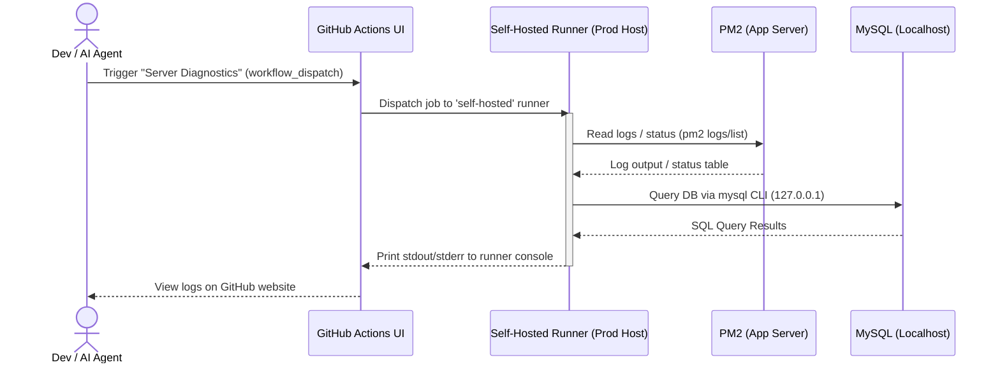

# Workspace Guide: Remote Server Diagnostics & DB/Log Access

When direct SSH or SQL port access to the production server is unavailable, this workspace uses a secure, out-of-band diagnostics pipeline built on **GitHub Actions Self-Hosted Runners** and manual workflow triggers.

---

## 🛠️ How It Works (The Architecture)



### 1. The Self-Hosted Runner
The production server hosts a GitHub Actions runner configured with `runs-on: self-hosted`. 
* Because the runner runs directly on the production machine, it has local shell access to files, processes, and localhost-bound databases.
* It operates inside the production network security perimeter, eliminating the need to expose ports like `22` (SSH) or `3306` (MySQL) to the public internet.

### 2. Manual Diagnostics Workflow (`debug.yml`)
The workflow is defined in [.github/workflows/debug.yml](file:///Users/jkmanye/Desktop/server/Flagia/.github/workflows/debug.yml). It is configured with `workflow_dispatch`, allowing it to be triggered manually from the GitHub UI under the **Actions** tab.

The workflow provides a choice input (`target`) to target specific inspection modules:
* `all`: Runs all checks listed below.
* `pm2`: Inspects PM2 application list, status, memory usage, and execution directories.
* `logs`: Fetches the last 60 lines of stdout and stderr logs for `flagia-backend`.
* `db`: Runs read-only queries against the local database.
* `health`: Tests HTTP endpoints (`/api/health`) on backend ports.
* `git`: Checks local repository HEAD commit hash and working tree status.
* `submissions`: Queries the latest student submissions and keystroke telemetry blobs.
* `regrade`: Runs the backend regrading script to re-evaluate submissions.

---

## 💾 Database Inspection (Without SQL Access)

The workflow runs SQL queries by invoking the `mysql` command-line client on the host.

### DB Connection Method
* **Host**: `127.0.0.1` (connections originate locally, satisfying host restrictions).
* **Credentials**: DB credentials (`DB_NAME`, `DB_MIGRATE_USER`, `DB_MIGRATE_PASS`) are stored in **GitHub Repository Secrets** and injected as environment variables during workflow execution.
* **Format**: Queries are run with the `-t` (table format) flag for easy markdown-like rendering in the action console:
  ```bash
  mysql --host=127.0.0.1 --user=$DB_USER --password=$DB_PASS $DB_NAME -t -e "SELECT ..."
  ```

### Common Debugging Queries Used in Workflows
* **Check User Profiles & Roles**:
  ```sql
  SELECT id, name, email, role, created_at FROM users WHERE role='ADMIN' ORDER BY created_at;
  ```
* **Submission Overview**:
  ```sql
  SELECT s.id, s.status, LENGTH(s.final_markdown) AS md_len, 
         (SELECT COUNT(*) FROM sessions se WHERE se.submission_id=s.id) AS sessions 
  FROM submissions s 
  JOIN users u ON s.student_id=u.id 
  WHERE u.email='student@example.com' 
  ORDER BY s.created_at DESC LIMIT 3;
  ```
* **Deconstruct Keystroke Telemetry (JSON)**:
  Extract typing rhythm statistics or specific event frequencies directly from the `events_blob` JSON column:
  ```sql
  SELECT jt.k AS key_val, COUNT(*) AS cnt 
  FROM sessions se 
  JOIN submissions s ON se.submission_id=s.id 
  JOIN users u ON s.student_id=u.id 
  JOIN JSON_TABLE(se.events_blob, '$[*]' COLUMNS (
      typ VARCHAR(20) PATH '$.type', 
      k VARCHAR(24) PATH '$.meta.key'
  )) jt 
  WHERE u.email='student@example.com' AND jt.typ='keydown' 
  GROUP BY jt.k 
  ORDER BY cnt DESC LIMIT 15;
  ```

---

## 📝 Log Inspection (Without SSH)

To read application output logs:
1. The self-hosted runner executes standard `pm2` command-line utilities.
2. It fetches historical logs using the `--nostream` flag to prevent the workflow from hanging.
   ```bash
   pm2 logs flagia-backend --out --lines 60 --nostream 2>/dev/null | tail -60
   pm2 logs flagia-backend --err --lines 60 --nostream 2>/dev/null | tail -60
   ```

---

## 🚀 How to Execute Diagnostics

1. Navigate to the GitHub repository online.
2. Go to the **Actions** tab.
3. Select the **Server Diagnostics** workflow on the left sidebar.
4. Click **Run workflow**, choose the desired **target** input (e.g., `db` or `logs`), and run.
5. Open the running/completed workflow run to inspect stdout under the **Diagnostics** step.
